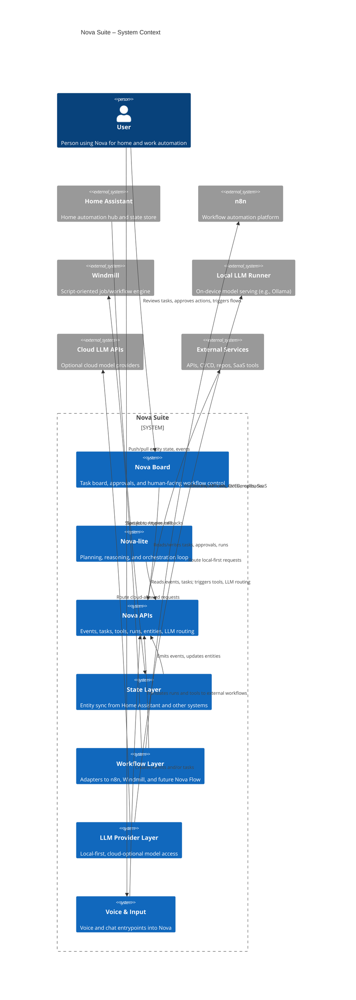
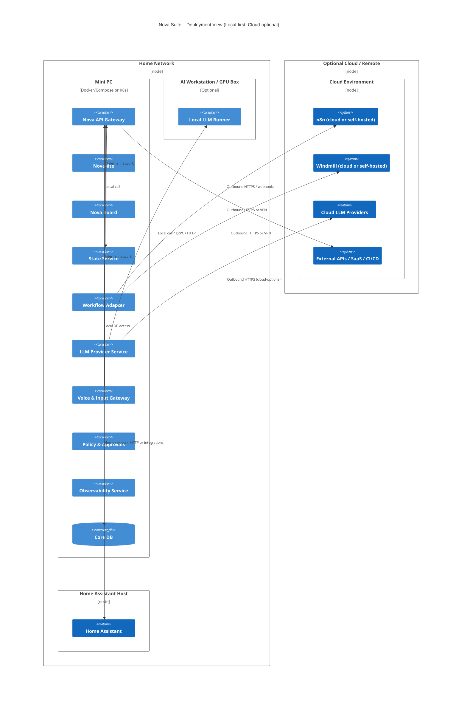
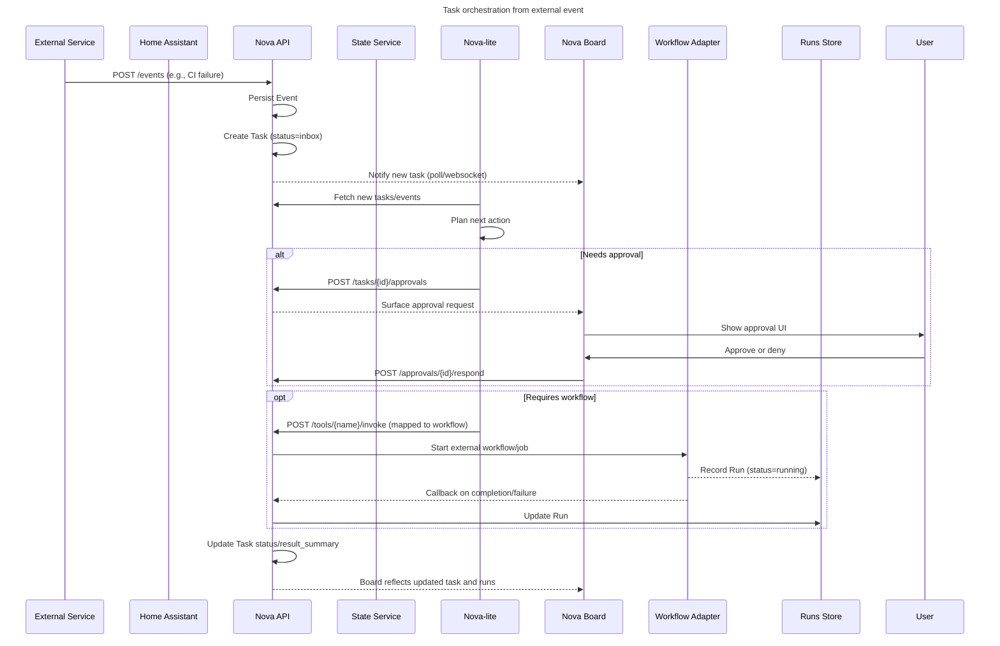
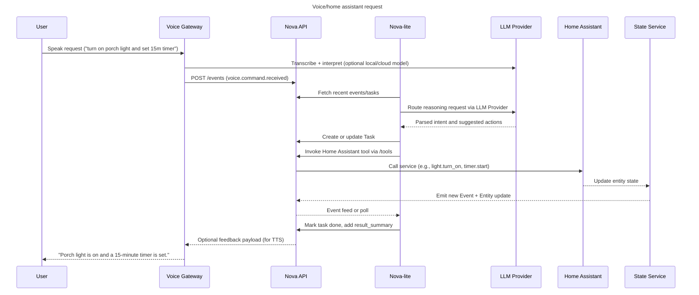
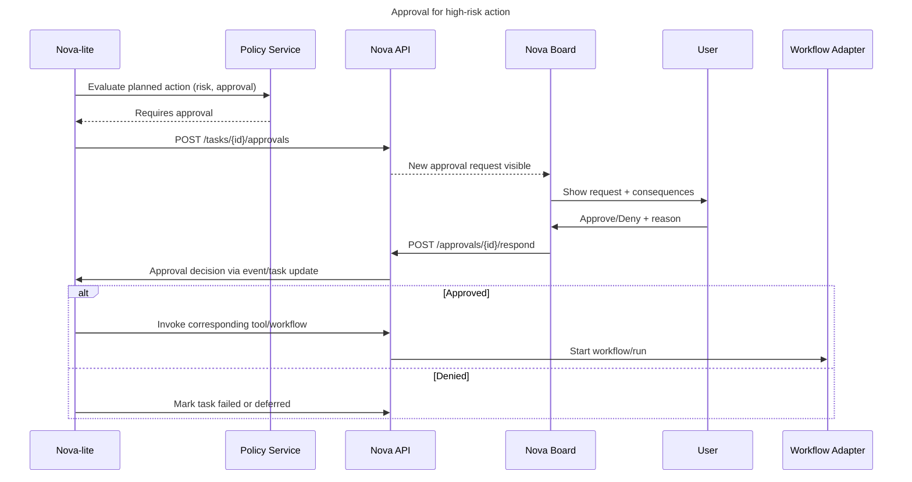
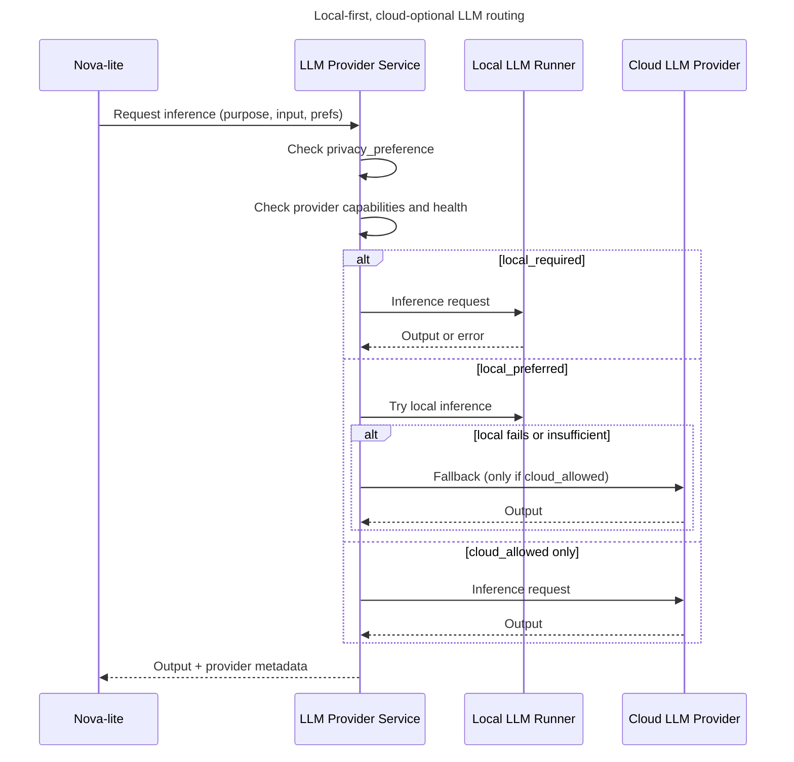
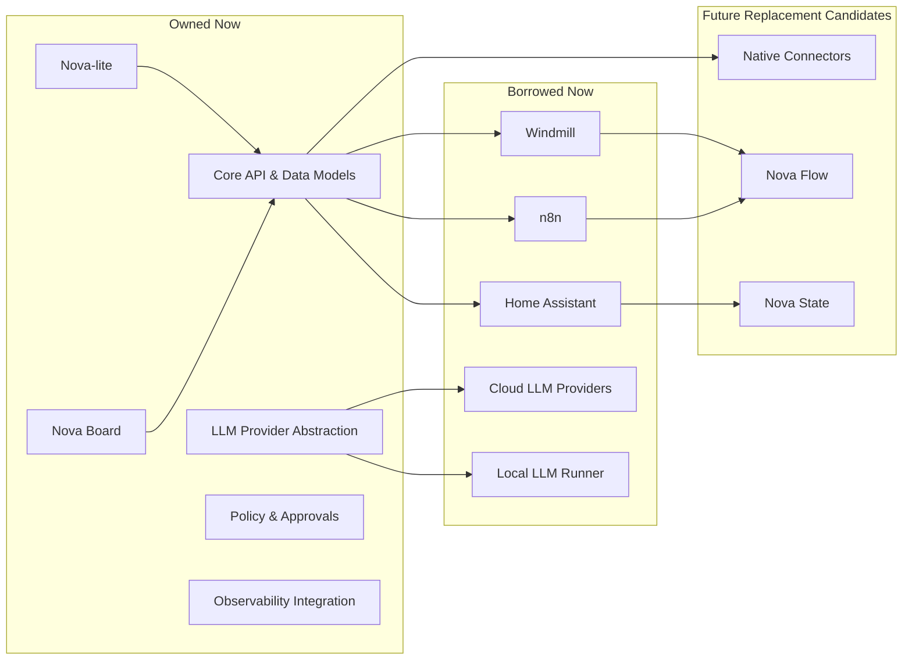

# 18 – Architecture Diagrams (Mermaid Source)

This document contains Mermaid source for the core Nova architecture diagrams. Diagrams are organized to mirror the diagram inventory.

---

## 18.1 System context diagram

---

## 18.2 Platform container diagram

```mermaid
C4Container
    title Nova Suite – Container View

    Person(user, "User")

    System_Boundary(nova, "Nova Suite") {
      Container(nova_api, "Nova API Gateway", "HTTP/JSON", "Events, tasks, tools, runs, entities, providers")

      Container(nova_lite, "Nova-lite", "Service", "Planner/agent loop using events, tasks, tools, and LLM provider")
      Container(nova_board, "Nova Board", "Web UI / Service", "Board, approvals, task management")
      Container(state_svc, "State Service", "Service", "Entity sync with Home Assistant and others")
      Container(workflow_adapter, "Workflow Adapter", "Service", "Bridges tools/runs to n8n, Windmill, future Nova Flow")
      Container(llm_provider, "LLM Provider Service", "Service", "Local-first model routing, cloud-optional")
      Container(voice_gateway, "Voice & Input Gateway", "Service", "Speech-to-text, text, and intent events into Nova")
      Container(policy_svc, "Policy & Approvals", "Service", "Rules for risk, approvals, and escalation")
      Container(obs_svc, "Observability Service", "Service", "Metrics, traces, logs, event streams")

      ContainerDb(core_db, "Core DB", "SQL/Document", "Tasks, events, runs, approvals, entities, provider profiles")
    }

    System_Ext(ha, "Home Assistant")
    System_Ext(n8n, "n8n")
    System_Ext(windmill, "Windmill")
    System_Ext(local_llm, "Local LLM Runner")
    System_Ext(cloud_llm, "Cloud LLM APIs")
    System_Ext(ext_services, "External Services")

    Rel(user, nova_board, "View tasks, approve, trigger")
    Rel(user, voice_gateway, "Speak/type requests")

    Rel(voice_gateway, nova_api, "POST events/tasks")
    Rel(nova_board, nova_api, "GET/POST/PATCH tasks, approvals, runs")
    Rel(nova_lite, nova_api, "Poll/subscribe events, update tasks, invoke tools, route LLM")

    Rel(nova_api, state_svc, "Sync entities, events")
    Rel(state_svc, ha, "Read/write entities, receive events")

    Rel(nova_api, workflow_adapter, "Invoke tools mapped to workflows/jobs")
    Rel(workflow_adapter, n8n, "Start workflows, receive webhooks")
    Rel(workflow_adapter, windmill, "Start jobs, receive callbacks")

    Rel(nova_api, llm_provider, "Route LLM calls")
    Rel(llm_provider, local_llm, "Local-first inference")
    Rel(llm_provider, cloud_llm, "Cloud-optional inference")

    Rel(nova_api, policy_svc, "Check risk and approval requirements")
    Rel(policy_svc, nova_board, "Surface approval requests")

    Rel(nova_api, core_db, "Read/write all core records")
    Rel(obs_svc, core_db, "Read events/runs for observability")
    Rel(nova_api, obs_svc, "Emit metrics, traces, logs")

    Rel(nova_api, ext_services, "Webhooks, outbound API calls")
```

---

## 18.3 Deployment diagram

---

## 18.4 Sequence – task orchestration flow

---

## 18.5 Sequence – voice/home action flow

---

## 18.6 Sequence – approval flow

---

## 18.7 Sequence – hybrid LLM routing

---

## 18.8 Ownership and evolution diagram

